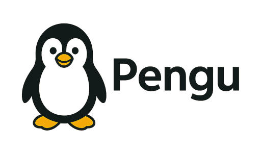
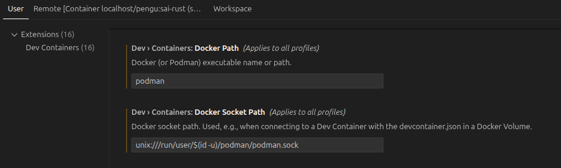

[](LICENSE)


[](FOSS_PLURALISM_MANIFESTO.md)
[](https://github.com/soyrochus/wormhole/issues)

# Pengu — your persistent Linux buddy

**Pengu** gives you a **real, persistent Linux environment** inside a container — instantly available from any operating system:  
✅ macOS ✅ Windows ✅ Linux



Pengu acts as a *personal Ubuntu machine per project*, mapped directly to your working directory.  
Anything you install or configure inside Pengu persists across sessions, restarts, and reboots.

> 🧩 One project → one Pengu container **per profile**  
> Persistent. Portable. Zero configuration.


## 🚀 What Pengu does

- Runs **Ubuntu 24.04** in a container (Podman or Docker)
- Mounts your project folder at `/workspace`
- Keeps a **persistent Linux home directory** per project/profile
- Lets you install anything (`apt`, `pip`, `uv`, language toolchains)
- Works identically across macOS, Linux, and Windows
- By changing or using your own "Pengufile" (Dockerfile) you can use any other Linux, software installacion or system configurtaion to suite your use case

In short:  
> Pengu gives you a clean, repeatable Linux workstation for every project.


## 🧩 Why Pengu

| Without Pengu | With Pengu |
|---------------|------------|
| “Works on my machine” | Same Linux everywhere |
| WSL / dual boot | Native containers |
| Toolchain conflicts | Isolated per project |
| Lost installs | Fully persistent |
| Manual onboarding | One command |


## 🪄 Quick install

Run this in **any project folder** (it does not need to be a git repo).

### Linux / macOS (Bash)

```bash
curl -fsSL https://raw.githubusercontent.com/soyrochus/pengu/main/pengu-install.sh | bash -s -- -y
````

### Windows (PowerShell)

```powershell
iwr -useb https://raw.githubusercontent.com/soyrochus/pengu/main/pengu-install.ps1 | iex
```

Pengu installs into a `.pengu/` folder:

```
.pengu/
├── Pengufile            # default build definition
├── Pengufile.<profile>  # optional profiles
```

Each Pengufile is a Dockerfile. It is renamed Pengufile not to come into conflict with existing Dockerfile in the target project.  

Installed helper scripts:

* `pengu` (Bash)
* `pengu.ps1` (PowerShell, Windows)


## 🚀 Getting started

```bash
./pengu up
./pengu shell
```

You are now inside Ubuntu with your project mounted at `/workspace`.

Anything installed inside Pengu persists:

```bash
pip install requests
sudo apt install htop
exit
./pengu shell   # everything is still there
```


## 🧩 Profiles

Pengu supports **multiple isolated profiles per project**.

### Default profile

```bash
./pengu up
./pengu shell
```

### Named profiles

```bash
./pengu up rust
./pengu shell rust

./pengu up nodejs
./pengu shell nodejs
```

Each profile:

* uses `.pengu/Pengufile.<profile>`
* has its **own container**
* has its **own persistent volumes**
* never interferes with other profiles

### Profile management

```bash
./pengu profile list
./pengu profile available
./pengu profile install rust
```

Available profiles typically include:

* **default** — general-purpose (Python, uv, build tools)
* **nodejs** — Node.js and npm
* **rust** — Rust toolchain


## 🧰 Commands

| Command                     | Description                      |
| --------------------------- | -------------------------------- |
| `./pengu up [profile]`      | Build and start container        |
| `./pengu shell [profile]`   | Enter shell as `pengu`           |
| `./pengu root [profile]`    | Enter as root                    |
| `./pengu stop`              | Stop container                   |
| `./pengu rm`                | Remove container (keep volumes)  |
| `./pengu rebuild [profile]` | Rebuild image                    |
| `./pengu commit [profile]`  | Save current image               |
| `./pengu nuke`              | Delete container **and** volumes |
| `./pengu help`              | Show help                        |


## 🧩 Using Pengu with Visual Studio Code (recommended)

The recommended workflow is to **attach VS Code to a running Pengu container**.

* VS Code runs natively on the host
* All tooling (language servers, debuggers, terminals) runs inside Pengu
* `/workspace` is used as the project root

### Requirements

* Visual Studio Code
* VS Code extension: **Dev Containers**
* Podman or Docker

### Podman one-time setup

```bash
podman system service --time=0 &
export DOCKER_HOST=unix:///run/user/$(id -u)/podman/podman.sock
```

### VSCode Settings

In recent VSCode you may need to change the configuration to podman specific values in the extensions' Settings screen 
File | Preferences | Settings).



### Attach

1. Start Pengu:

   ```bash
   ./pengu up
   ```
2. In VS Code:

   ```
   Dev Containers: Attach to Running Container
   ```
3. Select:

   ```
   myproject-pengu-default
   myproject-pengu-rust
   myproject-pengu-nodejs
   ```

VS Code reopens attached to the container automatically.


## 🏗️ Technical details

Detailed architecture, volume strategy, security model, performance, and troubleshooting are documented in:

👉 **[TECHSPEC.md](TECHSPEC.md)**


## 🧩 For teams and templates

Add Pengu to any onboarding doc or starter repo:

```bash
curl -fsSL https://raw.githubusercontent.com/soyrochus/pengu/main/pengu-install.sh | bash -s -- -y
```

No WSL, no VMs, no local toolchain setup required.


## 🛠 Maintainers

Repository layout:

```
.pengu/Pengufile        # Default build definition
pengu                  # Bash helper
pengu.ps1              # PowerShell helper
pengu-install.sh       # Bash installer
pengu-install.ps1      # PowerShell installer
README.md
```

Release process:

1. Test locally
2. Tag a release
3. Users can pin versions:

   ```bash
   curl -fsSL https://raw.githubusercontent.com/soyrochus/pengu/v24.10.0/pengu-install.sh | bash -s -- -y
   ```


[](https://raw.githubusercontent.com/soyrochus/pengu/main/pengu-install.sh)

**Pengu** — a penguin in your pocket. 🐧


## Principles of Participation

Everyone is invited and welcome to contribute: open issues, propose pull requests, share ideas, or help improve documentation.  
Participation is open to all, regardless of background or viewpoint.  

This project follows the [FOSS Pluralism Manifesto](./FOSS_PLURALISM_MANIFESTO.md),  
which affirms respect for people, freedom to critique ideas, and space for diverse perspectives.  


## License and Copyright

Copyright (c) 2025, Iwan van der Kleijn

This project is licensed under the MIT License. See the [LICENSE](LICENSE) file for details.
