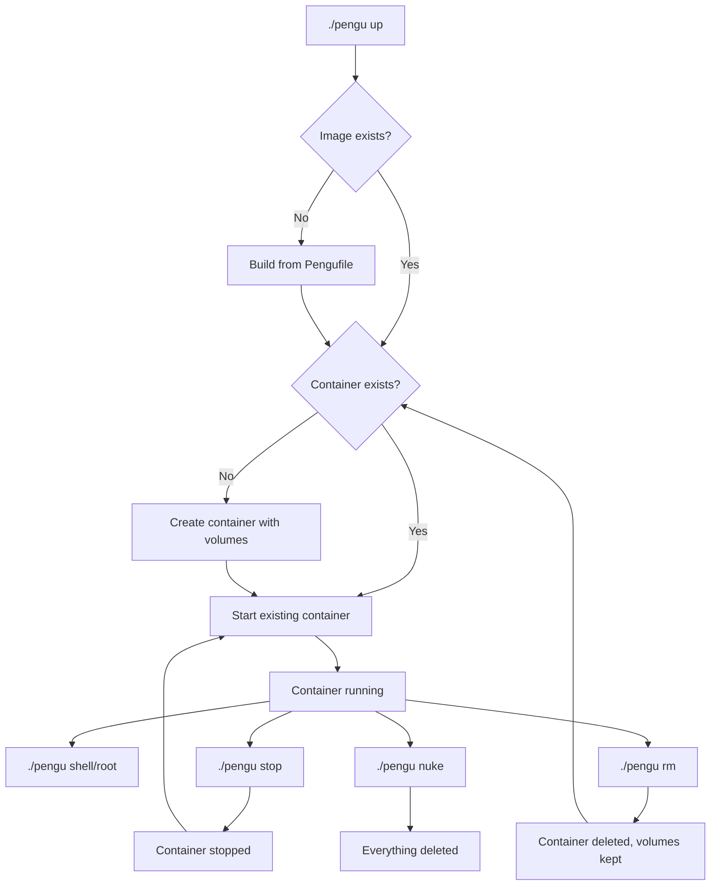

[](LICENSE)


[](FOSS_PLURALISM_MANIFESTO.md)
[](https://github.com/soyrochus/wormhole/issues)

# Pengu — your persistent Linux buddy

**Pengu** gives you a **real, persistent Linux environment** inside a container — instantly available from any operating system:  
✅ macOS ✅ Windows ✅ Linux


It’s a lightweight way to have a *personal Ubuntu machine* always mapped to your project folder.  
Whatever you install or configure inside Pengu stays there — between runs, reboots, or even host restarts.

> 🧩 One project → one Pengu container (per profile).  
> Persistent. Portable. Zero configuration.

---

## 🚀 What Pengu does

- **Runs Ubuntu in a container** (via Podman or Docker).  
- **Mounts your current folder** at `/workspace` so your code stays local.  
- **Keeps its own Linux home directory** in a persistent volume (`<project>-pengu-home`).  
- Lets you **install anything** (`apt install`, `pip install`, etc.) and keep it between sessions.  
- Works seamlessly across operating systems — same setup for everyone.  

In short:  
> Pengu gives you a *personal Linux buddy* for every project — always ready, always clean, always yours.

---

## 🧩 Why it’s useful

| Without Pengu | With Pengu |
|----------------|------------|
| “Works on my machine” issues | Same Linux everywhere |
| Needing WSL or dual boot | Runs natively via Podman/Docker |
| Losing installed tools after rebuild | Everything persists |
| Team setup differences | Identical, reproducible environment |

---

## 🪄 Quick install (one line)

Copy this into any project folder (it doesn't need to be a git repo):

### Linux/macOS (Bash)

```bash
curl -fsSL https://raw.githubusercontent.com/soyrochus/pengu/main/pengu-install.sh | bash -s -- -y
```

### Windows (PowerShell)

```powershell
iwr -useb https://raw.githubusercontent.com/soyrochus/pengu/main/pengu-install.ps1 | iex
```

That's it!

Pengu keeps its config in `.pengu/`:
- `.pengu/Pengufile` is the default build file
- Add `.pengu/Pengufile.<name>` for extra profiles, then `./pengu up <name>`

**What gets downloaded:**

- **Bash install**: `.pengu/Pengufile` (Dockerfile syntax) and `pengu` (bash script)
- **PowerShell install**: `.pengu/Pengufile`, `pengu.ps1`, and `pengu` (for compatibility)

Then start Pengu:

**Linux/macOS:**

```bash
./pengu up
./pengu shell
```

**Windows:**

```powershell
.\pengu.ps1 up
.\pengu.ps1 shell
```

You're now inside Ubuntu 24.04 with your project mounted at `/workspace`.

---

## 🚀 Getting started

### Your first Pengu session

After installation, here's your typical workflow:

```bash
# Start Pengu (builds container on first run)
./pengu up

# Enter your Linux environment
./pengu shell

# You're now inside Ubuntu! Your project is at /workspace
cd /workspace
ls -la

# Install something for this project
pip install requests
sudo apt install htop

# Exit when done
exit

# Your installed packages persist between sessions
./pengu shell  # Everything you installed is still there!
```

### When to use each command

- **`./pengu shell`** - Your daily driver. Opens as regular user `pengu`
- **`./pengu root`** - When you need system privileges (installing packages with `apt`)
- **`./pengu stop`** - Pause Pengu when not needed (saves resources)
- **`./pengu rebuild`** - Start fresh but keep your data (useful after Pengufile changes)
- **`./pengu commit`** - Save current state as a new base image (for custom setups)
- **`./pengu nuke`** - Complete reset when you want to start over

### Common workflows

**Installing system packages:**

```bash
./pengu root
sudo apt update && sudo apt install nodejs npm
exit
./pengu shell  # Back to regular user with nodejs available
```

**Python development:**

```bash
./pengu shell
pip install django flask  # Installs to /home/pengu/.local/bin
python -m django startproject myapp
```

**Creating a custom base:**

```bash
./pengu shell
# Install everything you need...
exit
./pengu commit  # Saves current state
# Now `./pengu up` uses your customized image
```

---

## 📖 Reference

### Command reference

| Command           | Description                        | Data preserved |
| ----------------- | ---------------------------------- | -------------- |
| `./pengu up`      | Build and start Pengu              | All            |
| `./pengu shell`   | Enter Ubuntu shell as user `pengu` | All            |
| `./pengu root`    | Enter as root                      | All            |
| `./pengu stop`    | Stop container                     | All            |
| `./pengu rm`      | Remove container (keep data)       | All volumes    |
| `./pengu rebuild` | Rebuild from Pengufile             | All volumes    |
| `./pengu commit`  | Save current state into image      | All            |
| `./pengu nuke`    | Delete container **and** volumes   | Nothing        |
| `./pengu help`    | Show detailed help                 | -              |

### Platform differences

**Linux/macOS:**

- Uses `./pengu` (bash script)
- SELinux labels applied automatically on Podman
- File permissions match your host user

**Windows:**

- Uses `.\pengu.ps1` (PowerShell script)
- Also installs `pengu` bash script for compatibility
- Fixed UID/GID (1000:1000) for simplicity

---

## 🔧 Under the hood

### Container architecture

Pengu creates a lightweight Ubuntu 24.04 container with these characteristics:

- **Base image**: `ubuntu:24.04` with essential tools pre-installed
- **User setup**: Creates a `pengu` user matching your host UID/GID (Linux/macOS)
- **Working directory**: `/workspace` (your project folder)
- **Default command**: `tail -f /dev/null` (keeps container running)

### Volume strategy

Pengu uses a 4-volume strategy for optimal performance and persistence (per profile, e.g. `<project>-pengu-default-home`):

#### 1. **Project workspace** (bind mount)

```text
Host: $PWD → Container: /workspace
```

- **Purpose**: Direct access to your project files
- **Behavior**: Real-time sync between host and container
- **Persistence**: Lives on your host filesystem
- **Performance**: Native filesystem speed

#### 2. **User home directory** (named volume)

```text
Volume: ${PROJECT}-pengu-home → Container: /home/pengu
```

- **Purpose**: Personal Linux environment
- **Contains**:
  - Dotfiles (`.bashrc`, `.vimrc`, `.gitconfig`)
  - Shell history and personal settings
  - Python packages (`pip install --user`)
  - SSH keys and credentials
  - Any files created in user's home
- **Persistence**: Survives container rebuilds
- **Isolation**: Separate per project

#### 3. **APT package cache** (named volume)

```text
Volume: ${PROJECT}-pengu-apt → Container: /var/cache/apt
```

- **Purpose**: Downloaded `.deb` package files
- **Benefit**: Dramatically speeds up repeated `apt install` commands
- **Behavior**: Packages downloaded once, reused forever
- **Size impact**: Can grow large but saves bandwidth

#### 4. **APT metadata cache** (named volume)

```text
Volume: ${PROJECT}-pengu-lists → Container: /var/lib/apt/lists
```

- **Purpose**: Package repository indexes and metadata
- **Benefit**: Faster `apt update` operations
- **Behavior**: Avoids re-downloading package lists
- **Updates**: Refreshed when you run `apt update`

### Container lifecycle



### Security model

- **User mapping**: Container user matches host user (prevents permission issues)
- **SELinux**: Automatic `:Z` labels on Podman for proper file access
- **Network**: Container has network access but no exposed ports by default
- **Filesystem**: Only your project directory is accessible to container

### Storage efficiency

Each project gets isolated storage:

```text
myproject/
├── .pengu/Pengufile     # Container definition
├── pengu               # Bash script
├── pengu.ps1           # PowerShell script  
└── your-project-files/

Docker volumes:
├── myproject-pengu-home    # User home (~50-200MB typical)
├── myproject-pengu-apt     # Package cache (~100-500MB)
└── myproject-pengu-lists   # Metadata (~10-50MB)
```

### Performance characteristics

- **Startup time**: ~1-3 seconds for existing containers
- **Build time**: ~30-60 seconds for first `./pengu up`
- **Package installs**: 2-5x faster after first install (due to caching)
- **File operations**: Native speed (bind mounts)
- **Memory usage**: ~50-100MB base + your applications

### What persists between operations

**What survives what:**

- **Container restart** (`./pengu stop` → `./pengu up`): Everything
- **Container rebuild** (`./pengu rebuild`): All volumes, fresh container
- **Image rebuild** (modify Pengufile → `./pengu rebuild`): All volumes
- **System reboot**: Everything (volumes are persistent)
- **Pengu nuke** (`./pengu nuke`): Nothing (complete reset)

### Project isolation benefits

**Benefits:**

- **No dependency conflicts** between projects
- **Experiment freely** without affecting other projects  
- **Quick cleanup** with `./pengu nuke`
- **Reproducible environments** for team members

Each project gets its own Pengu container and volumes, automatically named after the folder (e.g. `myapp-pengu`).
This design keeps your environments clean, isolated, and disposable.

> Want a fresh start?
> Run `./pengu nuke` — all gone, instantly.

### Removing Pengu from a project

**Linux/macOS:**

```bash
rm -rf .pengu pengu pengu.sh pengu.ps1
podman volume rm -f "$(basename "$PWD")-pengu-home" || true
```

**Windows (PowerShell):**

```powershell
Remove-Item -Force -ErrorAction SilentlyContinue -Recurse .pengu, pengu, pengu.sh, pengu.ps1
podman volume rm -f "$((Get-Item .).Name)-pengu-home"
```

---

## 🧩 For teams and templates

---

## 💾 What persists

| Location                               | Purpose                                   | Persists between runs |
| -------------------------------------- | ----------------------------------------- | --------------------- |
| `/workspace`                           | Your local project folder                 | ✅ (on your host)      |
| `/home/pengu`                          | Pengu user’s home (pip, caches, dotfiles) | ✅ (named volume)      |
| `/var/cache/apt`, `/var/lib/apt/lists` | apt caches                                | ✅ (named volumes)     |

Anything installed inside Pengu (via `sudo apt install` or `pip install`) will stay available for that project.

---

## 🧱 One Pengu per project (by design)

Each project gets its own Pengu container and volumes, automatically named after the folder (e.g. `myapp-pengu`).
This design keeps your environments clean, isolated, and disposable.

> Want a fresh start?
> Run `./pengu nuke` — all gone, instantly.

---

## 🧰 Pengu commands

| Command           | Description                        |
| ----------------- | ---------------------------------- |
| `./pengu up`      | Build and start Pengu              |
| `./pengu shell`   | Enter Ubuntu shell as user `pengu` |
| `./pengu root`    | Enter as root                      |
| `./pengu stop`    | Stop container                     |
| `./pengu rm`      | Remove container (keep data)       |
| `./pengu rebuild` | Rebuild from Dockerfile            |
| `./pengu commit`  | Save current state into image      |
| `./pengu nuke`    | Delete container **and** volumes   |

---

## 🧯 Remove Pengu from a project

**Linux/macOS:**

```bash
rm -rf .pengu pengu pengu.sh pengu.ps1
podman volume rm -f "$(basename "$PWD")-pengu-home" || true
```

**Windows (PowerShell):**

```powershell
Remove-Item -Force -ErrorAction SilentlyContinue -Recurse .pengu, pengu, pengu.sh, pengu.ps1
podman volume rm -f "$((Get-Item .).Name)-pengu-home"
```

---

## 🧩 Using Pengu with Visual Studio Code 

The recommended way to use Pengu with **Visual Studio Code** is to **attach VS Code to a running Pengu container**.

In this setup:

* VS Code runs **natively on your host**
* Your project files stay on the host filesystem
* All **tooling, terminals, language servers, and debuggers run inside Pengu**
* `/workspace` inside Pengu is used as the project root

This gives you full IDE support with clean, container-isolated environments.

---

### Requirements

* Visual Studio Code on the host
* VS Code extension: **Dev Containers**
* Pengu container running via Podman or Docker

---

### One-time setup (Podman)

VS Code connects via a Docker-compatible API.
If you use Podman, expose its socket:

```bash
podman system service --time=0 &
```

(Optional but recommended)

```bash
export DOCKER_HOST=unix:///run/user/$(id -u)/podman/podman.sock
```

---

### Attach VS Code to a running Pengu container

1. Start Pengu:

   ```bash
   ./pengu up
   ```

2. Open VS Code
3. Open the Command Palette:

   * macOS: `Cmd + Shift + P`
   * Linux / Windows: `Ctrl + Shift + P`
   
4. Run:

   ```
   Dev Containers: Attach to Running Container
   ```
5. Select your Pengu container, for example:

   ```
   myproject-pengu-default
   myproject-pengu-java25
   myproject-pengu-rust
   ```

VS Code will reopen attached to the container and use `/workspace` automatically.

---

### Why this works well

* Native VS Code UX with container-isolated toolchains
* No file copying or rebuilding
* Works across macOS, Linux, and Windows
* Clean support for multiple Pengu profiles per project

This is the preferred way to use Pengu with Visual Studio Code.


---

## 🧩 For teams and templates

Add Pengu to any starter repo or onboarding doc with:

```bash
curl -fsSL https://raw.githubusercontent.com/soyrochus/pengu/main/pengu-install.sh | bash -s -- -y
```

That’s all your teammates need — no local setup, no WSL, no VMs.


## 📝 Incorporate minimal Pengu documentation in your README

To include a segment with explanation of and pointer to Pengu, you could add the following segment to your README.

````text
## 🐧 Development Environment

This project uses [Pengu](https://github.com/soyrochus/pengu) — a tool that gives you a persistent Linux environment in a container, instantly available from any operating system.

**Get started:**
```bash
# Install Pengu (Linux/macOS)
curl -fsSL https://raw.githubusercontent.com/soyrochus/pengu/main/pengu-install.sh | bash -s -- -y

# Start your Linux environment
./pengu up && ./pengu shell
```

**Windows:**

```powershell
iwr -useb https://raw.githubusercontent.com/soyrochus/pengu/main/pengu-install.ps1 | iex
.\pengu.ps1 up; .\pengu.ps1 shell
```

Your project files are available at `/workspace` with all dependencies pre-configured. No local setup required.

````

## 🛠 Maintainers

This repo (`soyrochus/pengu`) contains:

```text
.pengu/Pengufile   # Default container definition (Dockerfile syntax)
pengu              # Bash helper script (symlinked to pengu.sh)
pengu.sh           # Bash helper script installed in projects  
pengu.ps1          # PowerShell helper script for Windows
pengu-install.sh   # Bash installer users run via curl | bash
pengu-install.ps1  # PowerShell installer for Windows
.gitignore
README.md
```

When you update Pengu:

1. Test locally with Podman and Docker.
2. Tag a release (`git tag v24.10.0 && git push --tags`).
3. Users can install a specific version:

   ```bash
   curl -fsSL https://raw.githubusercontent.com/soyrochus/pengu/v24.10.0/pengu-install.sh | bash -s -- -y
   ```

---

[](https://raw.githubusercontent.com/soyrochus/pengu/main/pengu-install.sh)

**Pengu** — a penguin in your pocket. 🐧


## Principles of Participation

Everyone is invited and welcome to contribute: open issues, propose pull requests, share ideas, or help improve documentation.  
Participation is open to all, regardless of background or viewpoint.  

This project follows the [FOSS Pluralism Manifesto](./FOSS_PLURALISM_MANIFESTO.md),  
which affirms respect for people, freedom to critique ideas, and space for diverse perspectives.  


## License and Copyright

Copyright (c) 2025, Iwan van der Kleijn

This project is licensed under the MIT License. See the [LICENSE](LICENSE) file for details.
