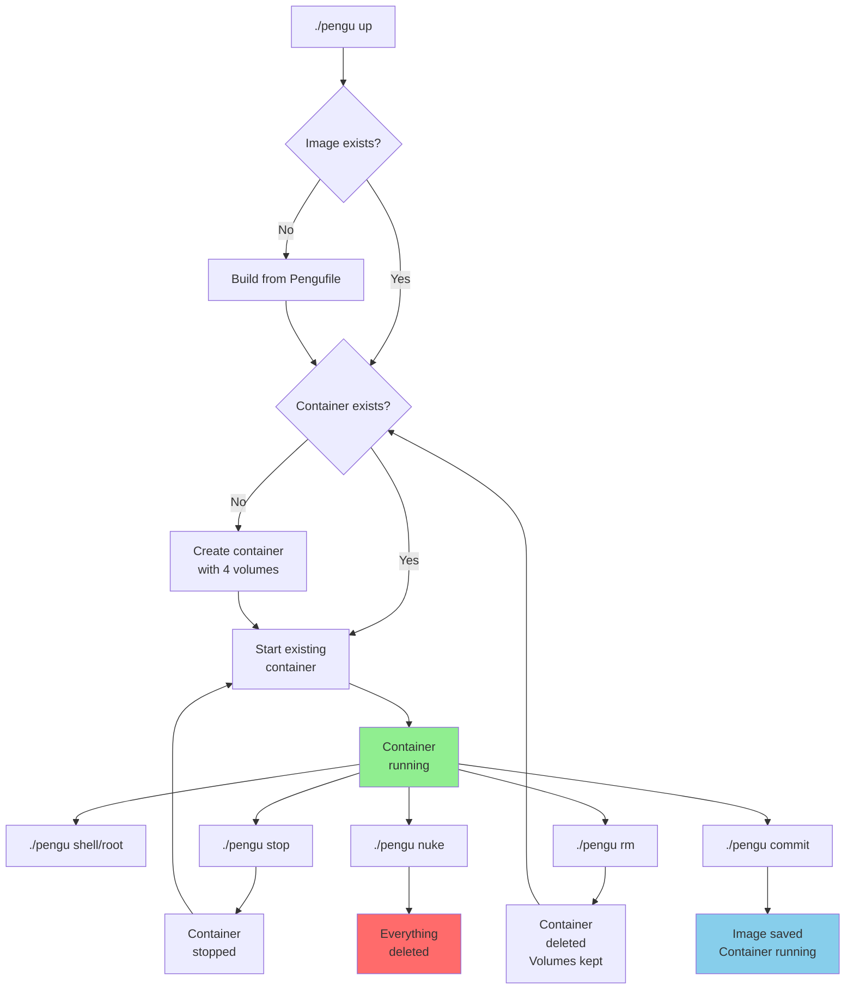

# Pengu Technical Specification

For user-level documentation, see [README.md](README.md).

---

## Container Architecture

Pengu creates a lightweight Ubuntu 24.04 container with these characteristics:

- **Base image**: `ubuntu:24.04` with essential tools pre-installed
- **User setup**: Creates a `pengu` user matching your host UID/GID (Linux/macOS)
- **Working directory**: `/workspace` (your project folder)
- **Default command**: `tail -f /dev/null` (keeps container running)

The Dockerfile is automatically installed to `.pengu/Pengufile` and can be customized per project or per profile.

---

## Volume Strategy

Pengu uses a 4-volume strategy for optimal performance and persistence. All volumes are automatically namespaced per project and profile (e.g., `<project>-pengu-<profile>-<type>`).

### 1. Project Workspace (Bind Mount)

```
Host: $PWD → Container: /workspace
```

**Characteristics:**
- **Purpose**: Direct access to your project files
- **Behavior**: Real-time sync between host and container
- **Persistence**: Lives on your host filesystem
- **Performance**: Native filesystem speed
- **Size**: Unbounded (your project size)

**Use case**: This is where you edit code, run builds, and manage project files.

---

### 2. User Home Directory (Named Volume)

```
Volume: ${PROJECT}-pengu-${PROFILE}-home → Container: /home/pengu
```

**Characteristics:**
- **Purpose**: Personal Linux environment isolation
- **Contents**:
  - Dotfiles (`.bashrc`, `.vimrc`, `.gitconfig`)
  - Shell history and personal settings
  - Python packages (`pip install --user`)
  - SSH keys and credentials
  - User-created files and cache directories
- **Persistence**: Survives container rebuilds and system reboots
- **Isolation**: Completely separate per project AND per profile
- **Size**: Typically 50-200MB per project

**Use case**: Your personal environment stays consistent across container lifecycle changes.

---

### 3. APT Package Cache (Named Volume)

```
Volume: ${PROJECT}-pengu-${PROFILE}-apt → Container: /var/cache/apt
```

**Characteristics:**
- **Purpose**: Downloaded `.deb` package files
- **Benefit**: Dramatically speeds up repeated `apt install` commands (2-5x faster)
- **Behavior**: Packages downloaded once, reused forever
- **Persistence**: Survives container rebuilds
- **Size impact**: 100-500MB typical (grows with package installs)
- **Cleanup**: Can be manually cleaned via `apt clean` inside container

**Performance impact**: First install of a package takes normal time; subsequent installs use cached `.deb` files for near-instant installation.

---

### 4. APT Metadata Cache (Named Volume)

```
Volume: ${PROJECT}-pengu-${PROFILE}-lists → Container: /var/lib/apt/lists
```

**Characteristics:**
- **Purpose**: Package repository indexes and metadata
- **Contents**: Package list files, version information, dependencies
- **Benefit**: Faster `apt update` operations
- **Behavior**: Avoids re-downloading package metadata from repositories
- **Updates**: Refreshed automatically when you run `apt update`
- **Size impact**: 10-50MB per project
- **Cleanup**: Automatically managed by apt; safe to remove if corrupted

**Performance impact**: Subsequent `apt update` calls are much faster as metadata is cached locally.

---

## Container Lifecycle



### Container States

- **Building**: Image is being built from Pengufile
- **Creating**: Container instance is created with volume mounts
- **Running**: Container is executing (waiting for input)
- **Stopped**: Container exists but is paused
- **Deleted**: Container removed but volumes preserved
- **Nuked**: Everything (container + volumes) destroyed

### Volume Behavior Across Operations

| Operation | Container | Volumes | Image |
|-----------|-----------|---------|-------|
| `./pengu up` | Restart existing or create new | ✅ All preserved | ✅ Rebuilt if needed |
| `./pengu shell` | Run command in existing | ✅ All preserved | No change |
| `./pengu stop` | Stop (pause) | ✅ All preserved | No change |
| `./pengu rm` | Delete | ✅ **All preserved** | No change |
| `./pengu rebuild` | Delete and recreate | ✅ **All preserved** | Rebuilt from Pengufile |
| `./pengu commit` | No change | ✅ All preserved | Saved as new image |
| `./pengu nuke` | Delete | ❌ **All deleted** | Rebuild needed |

---

## Security Model

### User Mapping
- **Linux/macOS**: Container's `pengu` user UID/GID matches host user's UID/GID
  - Prevents permission issues when files are created in `/workspace`
  - Files edited in container appear as owned by your host user
- **Windows**: Fixed UID/GID (1000:1000) for consistency
  - Windows doesn't have native UID/GID; Docker/Podman abstracts this

### SELinux Support
- **Podman on SELinux-enabled systems**: Automatic `:Z` labels applied to all mounts
  - Ensures container can access mounted directories
- **Docker**: No special SELinux handling needed

### Network Isolation
- **Default**: Container has outbound network access
- **No exposed ports**: By default, container doesn't expose services to host
- **Custom networking**: Can be configured via container settings if needed

### Filesystem Isolation
- **Read/write access**: Only to `/workspace` (your project)
- **Read-only access**: System directories are read-only (can't break OS)
- **Volume isolation**: Each project's volumes are completely separate

---

## Storage Efficiency

### Project Layout

```
myproject/
├── .pengu/
│   ├── Pengufile           # Default profile (required)
│   ├── Pengufile.rust      # Optional: Rust-specific profile
│   └── Pengufile.python    # Optional: Python-specific profile
├── pengu                   # Bash helper script
├── pengu.ps1               # PowerShell helper script
└── your-project-files/
    ├── src/
    ├── package.json
    └── README.md
```

### Docker Volumes (per project)

Each project creates isolated volumes:

```
Docker volume storage:
├── myproject-pengu-default-home    # User home (~50-200MB)
├── myproject-pengu-default-apt     # APT cache (~100-500MB)
├── myproject-pengu-default-lists   # APT metadata (~10-50MB)
├── myproject-pengu-rust-home       # Separate Rust profile home
├── myproject-pengu-rust-apt        # Separate Rust profile cache
└── ...                             # (one set per profile)
```

### Disk Space Estimates

Per project + profile:
- **Minimum**: ~100MB (base container)
- **With typical packages**: 300MB-1GB
- **Large dev environment**: 2-5GB
- **Multiple profiles**: 2-10GB (shared base, separate caches)

Total space is largely determined by installed packages and APT caches.

---

## Performance Characteristics

### Startup Times

- **First run** (`./pengu up`): 30-60 seconds
  - Includes base image download (if needed) and Pengufile build
- **Subsequent `./pengu up`**: 3-5 seconds
  - Image exists, container created from existing image
- **Container restart** (`./pengu stop` → `./pengu up`): 1-3 seconds
  - Just starting existing container

### Build Times

- **Cold build** (no cache): 30-60 seconds
  - Downloads and installs base OS packages
  - Runs all Dockerfile commands from scratch
- **Warm build** (`./pengu rebuild`): 5-15 seconds
  - Reuses image layers from previous builds
  - Only rebuilds if Pengufile changed

### Package Installation

- **First `apt install`**: Normal speed
- **Subsequent `apt install`** (same package): Near-instant
  - Uses APT cache volumes
  - 2-5x faster than re-downloading

### File Operations

- **Bind-mounted `/workspace`**: Native filesystem speed
  - No performance penalty for file I/O
  - Build tools, linters, etc. run at native speed
- **Volume operations** (`/home/pengu`, `/var/cache/apt`): Slightly slower
  - Docker/Podman overhead: typically <5% slower than native

---

## Multi-Profile Architecture

### Profile Basics

Each project can have multiple build profiles with separate configurations:

```bash
./pengu up                # Uses .pengu/Pengufile (default)
./pengu up rust           # Uses .pengu/Pengufile.rust
./pengu up python-ml      # Uses .pengu/Pengufile.python-ml
```

### Volume Isolation Per Profile

Each profile gets its own complete set of volumes:

```
Example: myapp with 2 profiles
├── myapp-pengu-default-home
├── myapp-pengu-default-apt
├── myapp-pengu-default-lists
├── myapp-pengu-rust-home        # Completely separate
├── myapp-pengu-rust-apt
├── myapp-pengu-rust-lists
└── /workspace (shared bind mount)
```

### Use Cases for Multiple Profiles

1. **Language variations**: Python vs Rust vs Node.js setups
2. **Tool versions**: Python 3.10 vs 3.12
3. **Deployment environments**: Dev vs test vs production-like
4. **Experimental setups**: Try new tools without affecting default

---

## What Persists Across Operations

### Container Restart
```
./pengu stop
./pengu up
```
✅ **Preserved**: Everything
- Home directory, installed packages, APT caches

### Container Rebuild
```
./pengu rebuild
```
✅ **Preserved**: All volumes (home, caches)
- Pengufile changes? Rebuilds image
- Your data and installed packages? Kept

### Image Rebuild
```
# Edit .pengu/Pengufile
./pengu rebuild
```
✅ **Preserved**: All volumes
- Image rebuilt from new Pengufile
- All your data stays in volumes

### System Reboot
✅ **Preserved**: Everything
- Docker/Podman survives reboot
- All volumes persistent on host

### After `./pengu nuke`
❌ **Lost**: Everything
- Container deleted
- All volumes deleted
- Home directory, packages, caches gone
- Fresh start required

---

## Pengufile Format

Pengufiles are standard Dockerfiles with Pengu-specific conventions.

### Minimal Example

```dockerfile
FROM ubuntu:24.04

ARG DEBIAN_FRONTEND=noninteractive
ARG USERNAME=pengu
ARG UID=1000
ARG GID=1000

# Install base tools
RUN apt-get update && apt-get install -y --no-install-recommends \
    curl wget git vim python3 python3-pip \
    && rm -rf /var/lib/apt/lists/*

# Create non-root user (matching host UID/GID)
RUN groupadd -g ${GID} ${USERNAME} 2>/dev/null || true && \
    useradd -m -u ${UID} -g ${GID} -s /bin/bash ${USERNAME} || true

WORKDIR /workspace
USER ${USERNAME}

ENV PATH="/home/${USERNAME}/.local/bin:${PATH}"
CMD ["bash"]
```

### Key Conventions

- **ARG DEBIAN_FRONTEND=noninteractive**: Prevents interactive prompts
- **Avoid `sudo`**: Not needed; run commands as root, then USER switch at end
- **Clean apt**: `rm -rf /var/lib/apt/lists/*` reduces image size
- **Create user**: Pengu automatically creates `pengu` user from args
- **WORKDIR**: Set to `/workspace`
- **USER**: Switch to `${USERNAME}` (defaults to `pengu`)
- **PATH**: Often includes `$HOME/.local/bin` for pip installs

---

## Image Layer Optimization

### Build Context

Pengu builds images from the project root (where `.pengu/Pengufile` lives):

```dockerfile
COPY . /workspace          # Copies entire project
```

To exclude files, create `.dockerignore`:

```
# .dockerignore
node_modules/
__pycache__/
.git/
.venv/
dist/
build/
```

### Layer Caching

Docker/Podman caches build layers. Changes invalidate subsequent layers:

```dockerfile
# Layer 1: Rarely changes
FROM ubuntu:24.04
RUN apt-get update && apt-get install -y curl

# Layer 2: Often changes
COPY . /workspace          # Invalidates cache if project files change

# Layer 3: Rebuilds due to Layer 2
RUN pip install -r requirements.txt
```

**Optimization**: Put stable layers first, volatile layers last.

---

## Troubleshooting Guide

### Container won't start

```bash
./pengu up
```

**Check**:
1. Docker/Podman running: `docker ps` or `podman ps`
2. Pengufile exists: `ls -la .pengu/Pengufile`
3. Build errors: `docker build -t test .` in project

### Disk space issues

```bash
# Check volumes
docker volume ls
docker volume inspect myproject-pengu-default-apt

# Clean APT cache (safe)
./pengu shell
apt clean
exit

# Remove entire project (destructive)
./pengu nuke
```

### Permission issues on Linux

```bash
# Container user UID/GID doesn't match host
# Check: id  (on host)
# Check: id  (inside container)

# If mismatched, rebuild (slow but fixes it)
PROJECT_NAME=myproject UID=$(id -u) GID=$(id -g) ./pengu rebuild
```

### SELinux denials (Podman)

```bash
# Error: "permission denied"
# Make sure Podman has SELinux labels

# Check if SELinux enabled
getenforce

# Pengu should auto-add :Z labels, but manually:
podman run -v /path:/path:Z image
```

---

## Advanced Topics

### Custom Build Arguments

Pengufile build args can be overridden via environment variables:

```bash
# Standard way (handled by pengu script)
./pengu up
# Uses UID/GID matching your host user

# For specific UID (rare)
PENGU_UID=2000 PENGU_GID=2000 ./pengu up
```

### Linking to External Services

Volumes are local; for external services use network:

```dockerfile
# Inside Pengufile
RUN apt-get install -y postgresql-client
CMD ["psql", "-h", "postgres-server", "-U", "user"]
```

Then connect to external database via hostname or IP.

### Copying Large Files Into Image

```dockerfile
# Avoid: COPY /large/files .
# Instead: Use volumes or download at runtime

RUN curl https://example.com/large-file.tar.gz | tar xz
```

---

## Contributing to Pengu Core

For contributing to Pengu itself (the `pengu` scripts), see [CONTRIBUTING.md](CONTRIBUTING.md) (if present) or the GitHub issues.

Key files:
- `pengu` - Main Bash script
- `pengu.ps1` - Main PowerShell script
- `pengu-install.sh` - Bash installer
- `pengu-install.ps1` - PowerShell installer

